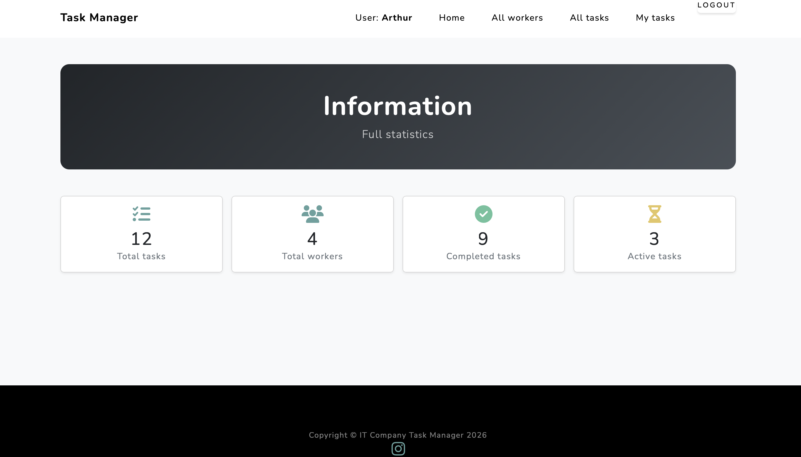

# -IT-Company-Task-Manager

A web application for managing tasks and employees at an IT company:
creating tasks, assigning executors, and tracking deadlines and statuses.

## link to the project in Github
https://github.com/spmspi/-IT-Company-Task-Manager.git

## Shell
* git clone https://github.com/spmspi/-IT-Company-Task-Manager.git
* cd -IT-Company-Task-Manager
* python3 -m venv venv
* source venv/bin/activate
* pip install -r requirements.txt
* python manage.py runserver

## Features

* User registration and authentication
* Task creation, editing, and deletion
* Assigning tasks to team members
* Deadline tracking (with highlighting for overdue and urgent tasks)
* Employee list with active and completed tasks
* Search functionality for tasks and employees

## Demo

